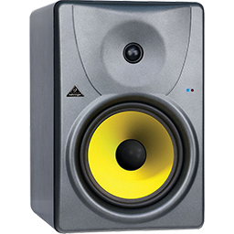
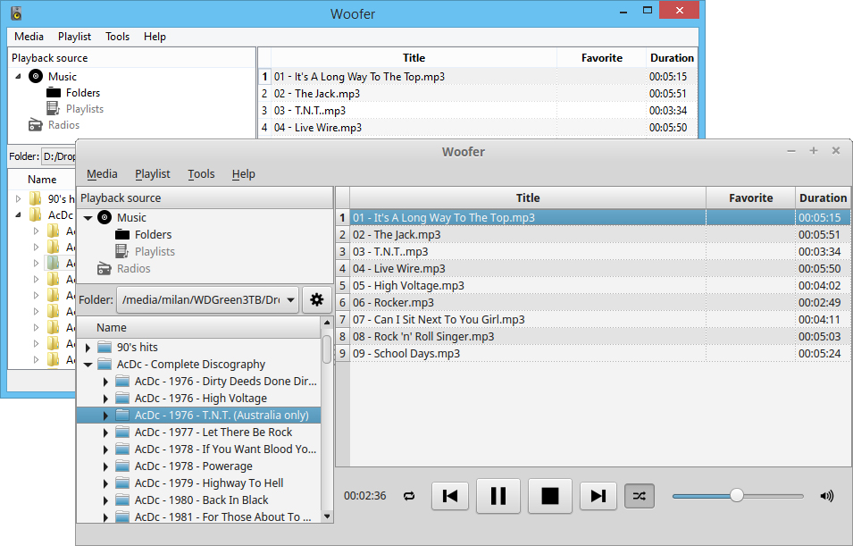

# Woofer player

Woofer player is **free open-source cross-platform** music player that plays most multimedia files, CDs, DVDs and also various online streams *(future)*. Whole written in Python and Qt provides easy, reliable, and high quality playback thanks to **LibVLC library** developed by [VideoLAN community](http://www.videolan.org/vlc/libvlc.html "").

## Main features

**Wide media support:** Woofer will play all audio what [VLC Media player](http://www.videolan.org/vlc/features.php?cat=audio "") can play.

**Folder based:** Your music is not ordered by album or interpret name, but only by its folder structure (on disk).

**Multi-platform:** Currently supports both Windows (XP and higher) and Linux (tested on Ubuntu distros).

**Fully portable:** No installation needed. Woofer will play right from your pen drive. 

and more will be coming ...

## Cross-platform

Thanks to Python, Qt and LibVLC, Woofer is developed to run on multiple operating systems. **Windows, Linux and Mac OS** platforms are supported. Currently Woofer is being tested only on Windows and Linux distribution, because I don't have any Mac OS device to test and debug. 

## Open-source

Most recent code is always available here on Github. Python code is readable, well documented and self-explanatory. Feel free to join or fork the project. Woofer is published under **GPL v2 license**.

**Used packages:**

- Python 2.7
- PyQt4 (Qt 4.8) - gui
- LibVLC Python wrapper - media playback
- Send2Trash - sends files to Trash
- Python-XLib - for system-wide keyboard shortcut detection (Linux)
- PyInstaller - to make binaries

Woofer uses new PyQt4 API v2, so migration to PyQt5/Python3 is possible and quite easy. But, I will stick with Python 2.7 because there is no reliable bug-free alternative to PyInstaller for Python 3.

## Future work

- multiple selection
- automatic application updates
- save/load playlists
- media streaming (live broadcasts)
