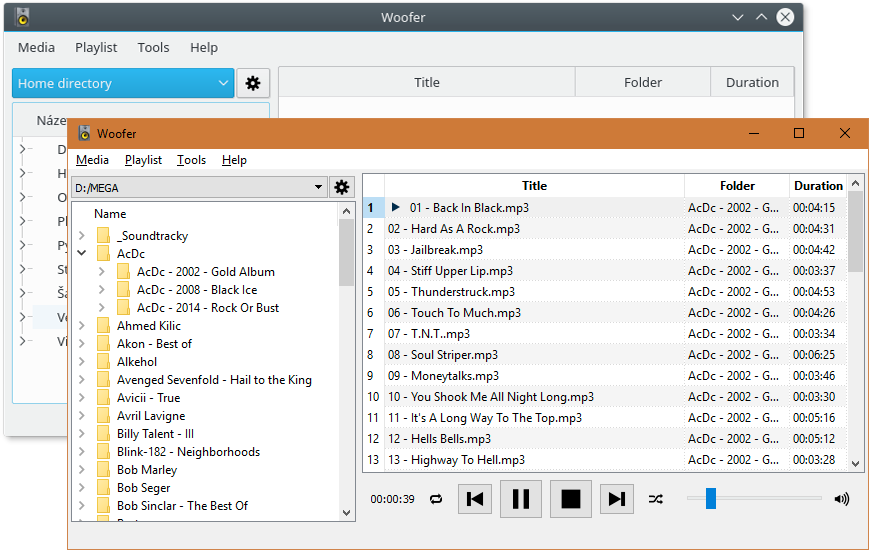

# Woofer player

Woofer player is **free open-source cross-platform** music player that plays most multimedia files, CDs, DVDs and also various online streams *(future)*. Whole written in Python and Qt provides easy, reliable, and high quality playback thanks to **LibVLC library** developed by [VideoLAN community](http://www.videolan.org/vlc/libvlc.html "").

## Main features

- **Wide media support:** Woofer will play almost every possible audio format. Check VLC [audio format support page](http://www.videolan.org/vlc/features.php?cat=audio "") for more information.
- **Folder based playback:** Your music is not ordered by album or interpret name, but only by its folder structure (on disk).
- **Multi-platform:** Currently supports both Windows (from XP up to Windows 10) and Linux (tested on Ubuntu distros).
- **Fully portable:** No installation needed. Woofer will play right from your pen drive.
- **Auto-updater:** Built-in update checking and installing on Windows.
- ***(New) Multi-language support:*** Make your own language .ini file. You can later post it on repo or by email. Finally your translation could be integrated to Woofer player. Currently available languages are English and Czech.
- ***(New) Gained volume:*** Ability to set volume level up to 150% without any background tweaking. That means up to 50% gain.
- and more will be coming, stay tuned ...

## Cross-platform

Thanks to Python, Qt and LibVLC, Woofer is developed to run on multiple operating systems. **Windows, Linux and Mac OS** platforms are supported. Currently Woofer is being tested only on Windows and Linux distribution, because I don't have any Mac OS device to test and debug.

<div align="center"></div>

## Open-source

Most recent code is always available here on Github. Python code is readable, well documented and self-explanatory. Feel free to join or fork the project.

Woofer is published under **GPL v3 license**.

**Used packages (Requirements):**

- [Python 2.7](https://www.python.org/downloads/)
- [PyQt4](http://www.riverbankcomputing.co.uk/software/pyqt/download) (4.11.4 is unstable!)
- [LibVLC Python wrapper](https://wiki.videolan.org/Python_bindings/)
- [Send2Trash](https://pypi.python.org/pypi/Send2Trash)
- [ujson](https://pypi.python.org/pypi/ujson)
- [Python-XLib](http://python-xlib.sourceforge.net/) (only for Linux)
- [PyInstaller v2](https://github.com/pyinstaller/pyinstaller/wiki) (only for build)
- [psutil v3](https://pypi.python.org/pypi?:action=display&name=psutil) (only for build)


Woofer uses new PyQt4 API v2, so migration to PyQt5/Python3 is possible and quite easy. For now I will stick with Python 2.7 <s>because there is no reliable bug-free alternative to PyInstaller for Python 3</s> (PyInstaller v3 now fully supports Python 3).

## Download

For Windows there are available binary distributions. On Linux you can run Woofer like any other Python application by `woofer.py` or you can build your own binary distribution, which however will depend on your distribution (distribution branch). Because there are so many Linux distributions and even most popular Ubuntu-based distributions have major version differences (new compiler, etc.), no pre-build Woofer binaries will be available. However I am planning to make Ubuntu ppa.

### Binaries (Windows)

Latest binary version for Windows can be found in [release section](https://github.com/m1lhaus/woofer/releases). This is a standalone version, no other libraries or VLC is needed! Newer versions than could be installed through built-in updater system (auto-updates feature).

### Run from source (Windows/Linux)

Refer to requirements for all needed packages to run Woofer. Both for Windows and Linux there are available suitable binaries (PyQt, etc.). No need to build anything from source. Unfortunately you also need VLC Media player installed (core libraries). Note that all these libraries are shipped with Woofer binary distribution.

Finally run `woofer.py` or `woofer.py --debug` in debug mode.

### How to make standalone binary distribution (Windows/Linux)

To create standalone binary distribution, install all listed requirements packages. Make sure to install PyInstaller v2 package and add binary to PATH. Before you run build script, you need to edit PyInstaller runtime hook for PyQt4, because PyInstaller doesn't consider setting PyQt (Sip) API to v2. So edit file at `%Python-dir%\Lib\site-packages\PyInstaller\loader\rthooks\pyi_rth_qt4plugins.py` and add these lines on top of the file:

```python
...
import sip
# set PyQt API to v2
sip.setapi('QDate', 2)
sip.setapi('QDateTime', 2)
sip.setapi('QString', 2)
sip.setapi('QTextStream', 2)
sip.setapi('QTime', 2)
sip.setapi('QUrl', 2)
sip.setapi('QVariant', 2)
...   
```

*On Linux, the file will be likely in `.../dist-packages/...` folder. Note that from now on whenever PyInstaller will package any PyQt4 script, it will set API v2 as default!*

You also need to provide VLC x86/x64 libraries (depending on python binary version) to build standalone distribution. Woofer has been tested with VLC 2.1x libraries, but any newer version should be fine. Download and extract or install VLC Media player. You need to provide paths to `libvlc.dll`, `libvlccore.dll` and `./plugins` folder in `build.py` script (header section). For default all these files should be located in Woofer root directory in `.\libvlc` or `.\libvlc64` folder (depending on Python binary version). When you have all packages installed and VLC core files linked, you can run `.\build\build.py` script. Result will be stored in `.\build\release` directory.

## Known issues

- random file order when adding file to playlist on Linux (caused by QDirIterator issue)
- unable to start local server after Woofer crashed (caused by opened/dangling socket)

## Future work

- save/restore playback time/position for playing media
- save/load playlists
- media streaming (live broadcasts)
